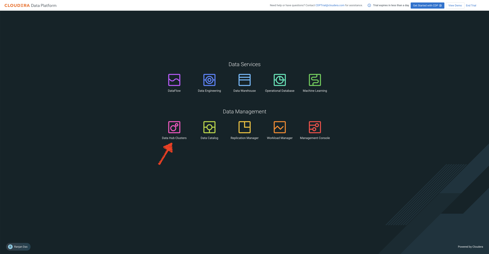
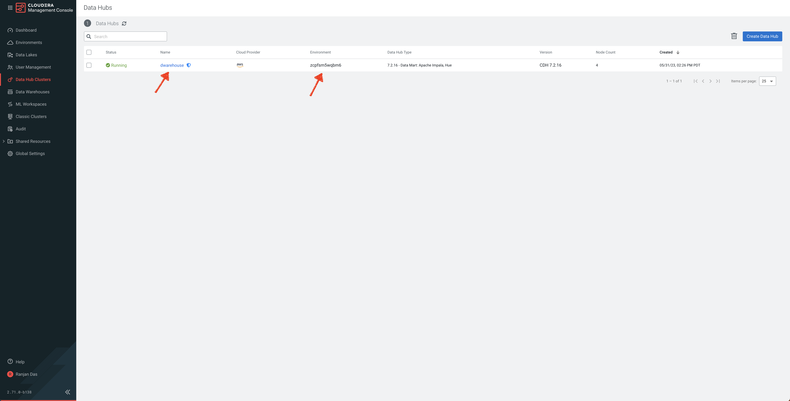
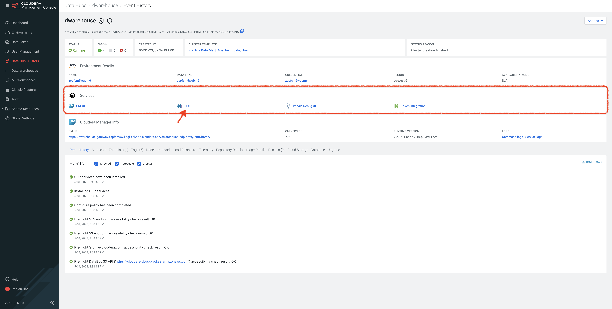
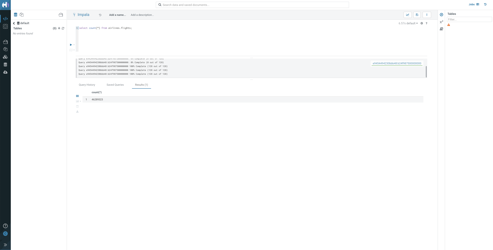

# 01_ingest

In this lab, we will ingest data from an S3 Bucket into Impala Tables using Hue. 

In a pattern that we will release shortly, we will use Cloudera Data Flow (CDF) to ingest data from numerous other sources. 

The primary goal of this is to build an ingestion data pipeline.
- Source data is pre-loaded in an S3 Bucket in CSV format. There are 5 datasets that we need to ingest into Impala.
    - Flights data
    - Airports data
    - Planes data
    - Airlines data
    - Passenger data
- We connect to the source bucket and pull all 5 datasets and ingest into the CDP Data Lakehouse (using Impala in this case) for further analysis in [Analyze](02_analyze.md) phase and ultimately into our Machine Learning Prediction Model.

## Lab 1: Ingest Flights data needed for Analysis and Prediction

- In this lab, we will first create a **raw layer** in our Data Lakehouse.  This raw layer will be created by leveraging CSV data that has already been stored in our Public Cloud storage, in this lab we will use S3, for the 5 table mentioned above
- This lab is meant to show how quickly you can take raw data and enable the ability to execute SQL queries against that data
- As part of the lab you will need to come up with a **Prefix** that will uniquely identify the databases you will create as part of this trial

1. In your CDP Home Page, click on **Data Hub Clusters**. (For more information about Data Hub, here is a [product tour](https://www.cloudera.com/products/data-hub/cdp-tour-data-hub.html))



2. In the Data Hub Clusters landing page - 

   a. **Note the Environment Name** as it will be used as one of the inputs while we create tables
   
   b. Click on the Data Hub called **dwarehouse**. 



3. In the list of Services in the Data Hub, click on **Hue** to access Impala.



4. You will be taken to Impala Editor. Create a database for the **raw layer** this database will be called **<prefix>_airlines_raw** (<prefix> will be replaced with your unique prefix) using the below query - 

```
CREATE DATABASE ${prefix}_airlines_raw;
```

* In the **prefix** field, enter a short unique identifier.  If you run this and it returns "Database already exists", it means this prefix was already used, choose another prefix value and rerun the query.

5. Create **flights** table

```
drop table if exists ${prefix}_airlines_raw.flights;

CREATE EXTERNAL TABLE ${prefix}_airlines_raw.flights (month int, dayofmonth int, dayofweek int, deptime int, crsdeptime int, arrtime int, crsarrtime int, uniquecarrier string, flightnum int, tailnum string, actualelapsedtime int, crselapsedtime int, airtime int, arrdelay int, depdelay int, origin string, dest string, distance int, taxiin int, taxiout int, cancelled int, cancellationcode string, diverted string, carrierdelay int, weatherdelay int, nasdelay int, securitydelay int, lateaircraftdelay int, year int)
ROW FORMAT DELIMITED FIELDS TERMINATED BY ',' LINES TERMINATED BY '\n'
STORED AS TEXTFILE LOCATION 's3a://${cdp_environment_name}/trial-odlh-data/airline-demo-data/flights' tblproperties("skip.header.line.count"="1");
```

* In **cdp_environment_name** field, enter the environment name you captured earlier

6. Query the newly created table, execute the below query - 

```
SELECT count(*) FROM ${prefix}_airlines_raw.flights;
```



7. Create **planes** table 

```
drop table if exists ${prefix}_airlines_raw.planes;

CREATE EXTERNAL TABLE ${prefix}_airlines_raw.planes (tailnum string, owner_type string, manufacturer string, issue_date string, model string, status string, aircraft_type string, engine_type string, year int)
ROW FORMAT DELIMITED FIELDS TERMINATED BY ',' LINES TERMINATED BY '\n'
STORED AS TEXTFILE LOCATION 's3a://${cdp_environment_name}/trial-odlh-data/airline-demo-data/planes' tblproperties("skip.header.line.count"="1");
```

8. Create **airlines** table 

```
drop table if exists ${prefix}_airlines_raw.airlines;

CREATE EXTERNAL TABLE ${prefix}_airlines_raw.airlines (code string, description string) 
ROW FORMAT DELIMITED FIELDS TERMINATED BY ',' LINES TERMINATED BY '\n'
STORED AS TEXTFILE LOCATION 's3a://${cdp_environment_name}/trial-odlh-data/airline-demo-data/airlines' tblproperties("skip.header.line.count"="1");
```

9. Create **airports** table 

```
drop table if exists ${prefix}_airlines_raw.airports;

CREATE EXTERNAL TABLE ${prefix}_airlines_raw.airports (iata string, airport string, city string, state string, country string, lat DOUBLE, lon DOUBLE)
ROW FORMAT DELIMITED FIELDS TERMINATED BY ',' LINES TERMINATED BY '\n'
STORED AS TEXTFILE LOCATION 's3a://${cdp_environment_name}/trial-odlh-data/airline-demo-data/airports' tblproperties("skip.header.line.count"="1");
```

10. Create Passenger Manifest **unique_tickets** table 

```
drop table if exists ${prefix}_airlines_raw.unique_tickets;

CREATE external TABLE ${prefix}_airlines_raw.unique_tickets (ticketnumber BIGINT, leg1flightnum BIGINT, leg1uniquecarrier STRING, leg1origin STRING,   leg1dest STRING, leg1month BIGINT, leg1dayofmonth BIGINT,   
 leg1dayofweek BIGINT, leg1deptime BIGINT, leg1arrtime BIGINT,   
 leg2flightnum BIGINT, leg2uniquecarrier STRING, leg2origin STRING,   
 leg2dest STRING, leg2month BIGINT, leg2dayofmonth BIGINT,   leg2dayofweek BIGINT, leg2deptime BIGINT, leg2arrtime BIGINT ) 
ROW FORMAT DELIMITED FIELDS TERMINATED BY ',' LINES TERMINATED BY '\n' 
STORED AS TEXTFILE LOCATION 's3a://${cdp_environment_name}/trial-odlh-data/airline-demo-data/unique_tickets' 
tblproperties("skip.header.line.count"="1");
```

## Lab 2: Create an Open Data Lakehouse powered by Apache Iceberg

- In this lab, we will ingest data from the **raw layer** we just created
- The ingested data will be written to Iceberg tables
- All Iceberg tables will use the Parquet file format, however, you can also use ORC or AVRO file formats for Iceberg tables

1. Now we can create a database for the **Open Data Lakehouse** this database will be called **<prefix>_airlines** (<prefix> will be replaced with your unique prefix) using the below query - 

```
CREATE DATABASE ${prefix}_airlines;
```

* In the **prefix** field, use the same value you used for Lab 1.

2. Execute the following below queries to create the **airports** table in an Iceberg table format by using the **CREATE TABLE, STORED AS ICEBERG** syntax

    a. Create **airports** table in an Icebrerg table format

```
drop table if exists ${prefix}_airlines.airports;

CREATE TABLE ${prefix}_airlines.airports (
   iata string, airport string, city string, state string, country string, lat DOUBLE, lon DOUBLE
)
STORED AS ICEBERG;
```

   b. Ingest data into the **airports** table from the raw layer airports table

```
INSERT INTO ${prefix}_airlines.airports
   SELECT * FROM ${prefix}_airlines_raw.airports;
```

   c. Check the table properties to see details for this Iceberg table

```
DESCRIBE FORMATTED ${prefix}_airlines.airports;
```

   d. Query the newly created table, execute the below query - 

```
SELECT * FROM ${prefix}_airlines.airports LIMIT 10;
```

3. Execute the following below queries to create a Partitioned table **flights** in an Iceberg table format by using the **CREATE TABLE, PARTITIONED BY (column_list), STORED AS ICEBERG** syntax

    a. Create **flights** table, partitioned by the **year** column, in an Icebrerg table format

```
DROP TABLE IF EXISTS ${prefix}_airlines.flights;

CREATE TABLE ${prefix}_airlines.flights (
 month int, dayofmonth int, 
 dayofweek int, deptime int, crsdeptime int, arrtime int, 
 crsarrtime int, uniquecarrier string, flightnum int, tailnum string, 
 actualelapsedtime int, crselapsedtime int, airtime int, arrdelay int, 
 depdelay int, origin string, dest string, distance int, taxiin int, 
 taxiout int, cancelled int, cancellationcode string, diverted string, 
 carrierdelay int, weatherdelay int, nasdelay int, securitydelay int, 
 lateaircraftdelay int
) 
PARTITIONED BY (year int)
STORED AS ICEBERG
TBLPROPERTIES('format-version'='2');
```

* The TBLPROPERTIES property **format-version** specifies to use version 2 of the Iceberg table spec, which provides row level ACID capabilties.

   b. Another way to check information on a table is to the the SHOW CREATE statement, this will show the syntax for creating this table

```
SHOW CREATE TABLE ${prefix}_airlines.flights;
```

* Scroll on the results to finr the PARTITIONED BY clause

   c. Ingest data into the **flights** table from the raw layer airports table, we will only grab the flight data from 1995 to 2006

```
INSERT INTO ${prefix}_airlines.flights
   SELECT * FROM ${prefix}_airlines_raw.flights
   WHERE year <= 2006;
```

   d. Query the newly created table, execute the below query - 

```
SELECT year, count(*) 
FROM ${prefix}_airlines.flights
GROUP BY year
ORDER BY year desc;
```

* Notice that flight volume has grown quite a bit since 1995, and from 2004 to 2006 data volume has been in the 7 million or so range

4. Migrate an existing table stored as a Managed Hive table format to an Iceberg table format.
- This is one of the ways to migrate tables to Iceberg, another option is In-Place Table Migration
- This would be used if you already have tables in a Cloudera DW that are stored in a Hive table format
- The migrated table will be named **planes** and will be stored in an Iceberg table format 
- We will first create a table named **planes_hive** in a Hive table format
- **planes_hive** will be a Managed Hive table
- To migrate this table to Iceberg we will need to run a CTAS statement (**CREATE TABLE AS SELECT, STORED AS ICEBERG** syntax)

    a. Create **planes_hive** table in an Icebrerg table format

```
drop table if exists ${prefix}_airlines.planes_hive;

CREATE TABLE ${prefix}_airlines.planes_hive
   AS SELECT * FROM ${prefix}_airlines_raw.planes;
```

   b. Ingest data into the **airports** table from the raw layer airports table

```
DESCRIBE FORMATTED ${prefix}_airlines.planes_hive;
```

   c. Check the table properties to see details for this Iceberg table

```
```

   d. Query the newly created table, execute the below query - 

```
```


We are now ready to [Analyze](02_analyze.md), [Visualize](03_visualize.md) and [Predict](04_predict.md) Data!
