# 03_visualize

As part of the `Visualize` phase, we will be working to create a Dashboard using the Data Lakehouse we created in the [01_ingest](01_ingest.md) phase.

In this phase, we will be deploying an end\-to\-end machine learning project that will also be used in the next phase, [04_predict](04_predict.md).

## Prerequisites

1. Please ensure that you have completed the [labs](01_ingest.md#01_ingest) to ingest the data needed for Visualization.

2. Set your CDP Workload Password

    a. On your browser navigate back to the CDP Management Console

    

    b. Go back to the CDP Home Page by clicking the bento menu icon in the top left corner of the Data Hub page

    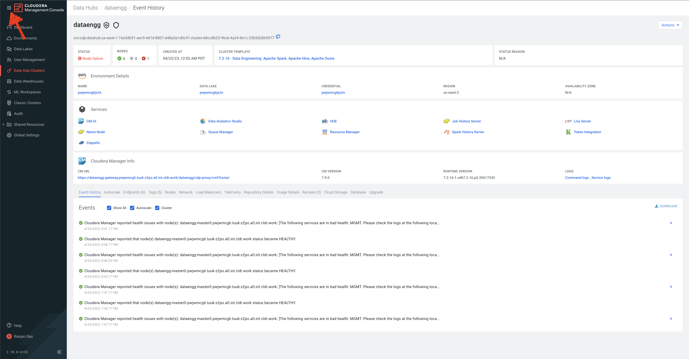

    c. In the bottom left corner, find your user ID and click on it. In the popup, click on `Profile`

    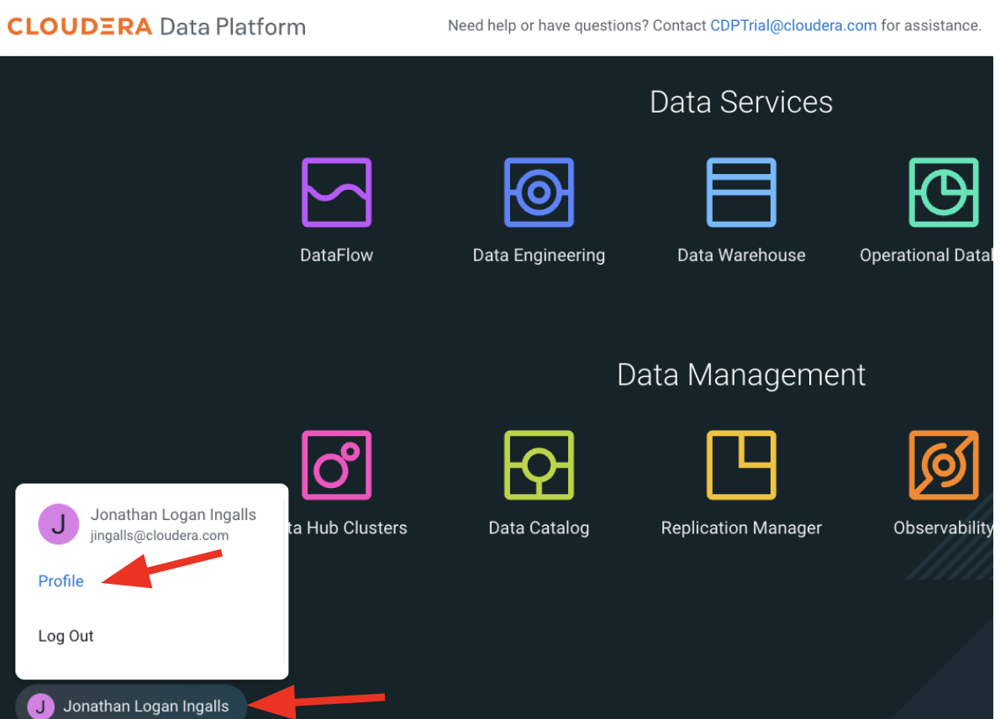

    d. On the User Profile page, click on `Set Workload Password`

    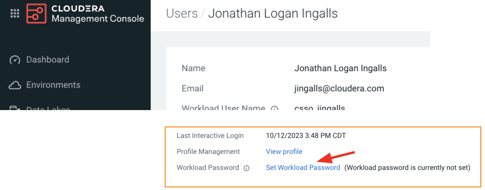

    e. Enter a strong password, confirm it, and click on `Set Workload Password`

    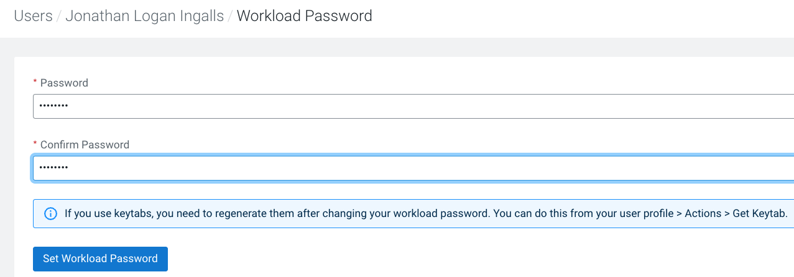

    - You should see a message that the Workload password has been updated.

    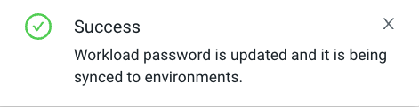

3. In Cloudera Machine Learning (CML), provide your CDP Workload Password

    a. Open Cloudera Machine Learning (CML)

    - Click the bento menu icon in the top left corner and select `Machine Learning`

    

    b. Note the name of the environment, listed under the `Environment` column, as it will be used as one of the inputs while we create our Machine Learning model.

    c. Click on the workspace name link, found under the `Workspace` column

    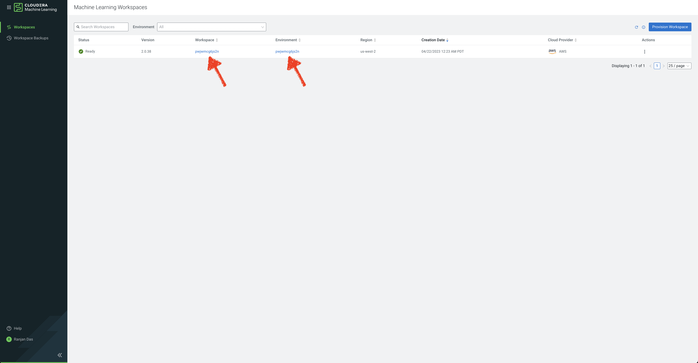

    d. Click on your user ID in the top right corner, and click

    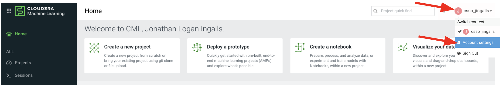

    e. On the User Profile page, click on the `Environment Variables` tab

    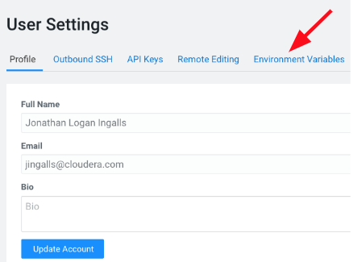

    f. Enter your Workload Password from **Step 2** in `WORKLOAD_PASSWORD` and click `Save`

    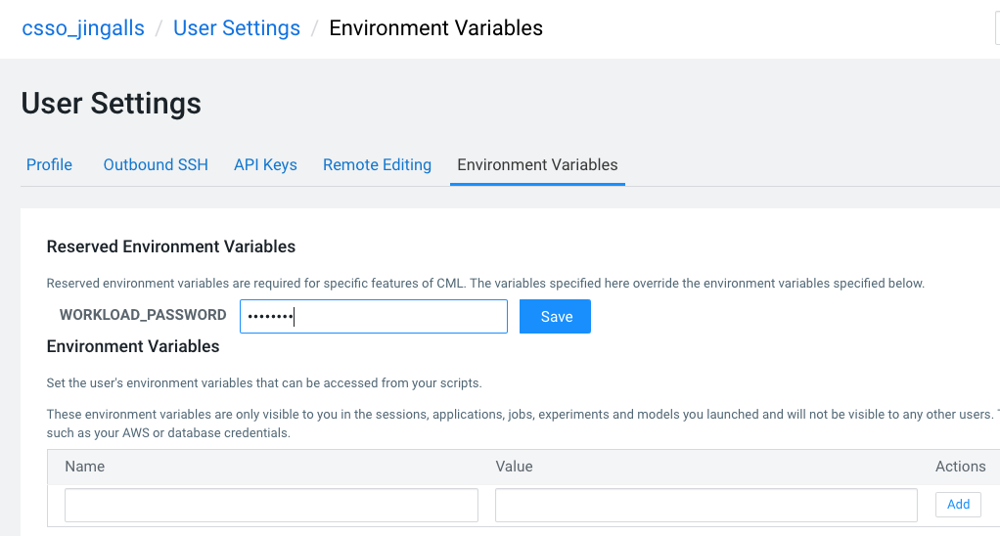

# Cloudera Machine Learning (CML) Project

## Lab 1: Deploy Machine Learning Applied Machine Learning Prototype (AMP)

1. Open Cloudera Machine Learning (CML)

    - If you just completed providing our Workload Password to CML, click on `Home` in the left navigation menu.

    - If not, you can always go back to the CDP Home Page by clicking the bento menu icon in the top left corner, click on `Home`, select the `Machine Learning` tile, and click on the available Workspace on the Machine Learning page (found under the `Workspace` column).

    
    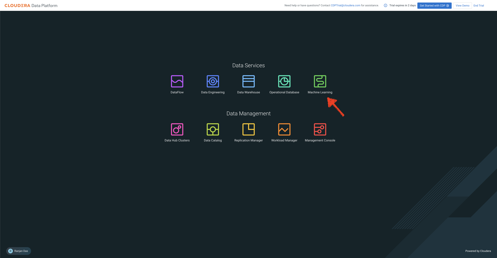
    

2. Click AMPs in the left menu

    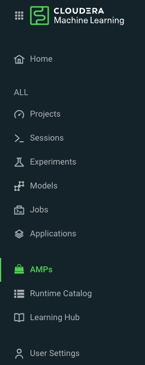

3. Cloudera Machine Learning (CML) will show you a catalog of available Machine Learning Prototypes

4. Search for the Canceled Flight Prediction prototype by entering `cancel` in the search box and clicking the prototype tile

    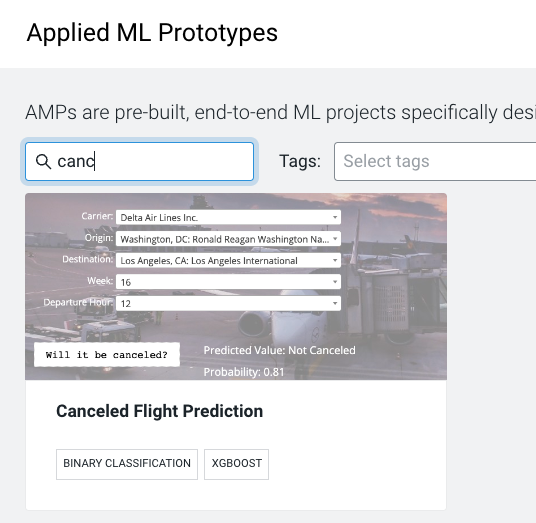

5. Now click `Configure Project`

    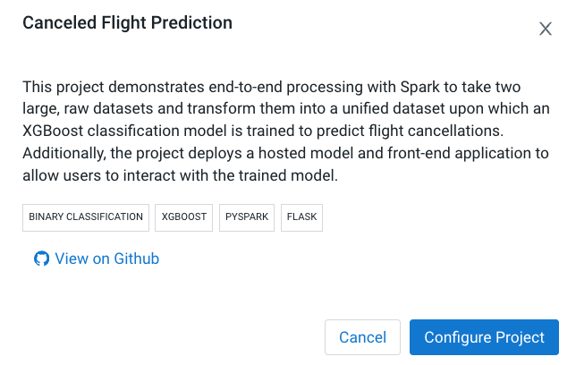

6. Wait for the Project to be created on the Project page \(takes a few seconds to load the code locally\)

    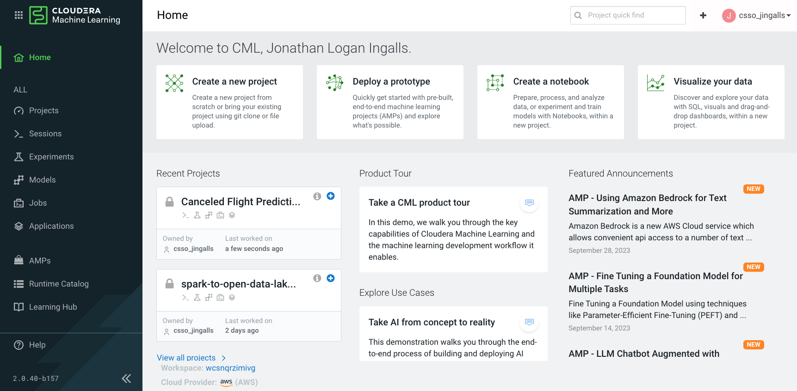

We have now created a Cloudera Machine Learning (CML) Project that will be populated with all of the content making up the AMP we just deployed.  This includes data, code, files, model definition, and a Flask application.

## Lab 2: Configure and Deploy Canceled Flight Prediction AMP

1. Open the created Cloudera Machine Learning (CML) Project you just created, named "Canceled Flight Prediction - &lt;user-id>" by clicking on the Project tile

    

2. CML will now give the user a series of Environment Variables to fill in. Fill as below:

    - `STORAGE_MODE` as local
    - `SPARK_CONNECTION_NAME` with the Environment Name we collected above.
    - `DW_DATABASE` as `<prefix>_airlines` - where &lt;prefix> is the same &lt;prefix> you used in the 01_ingest phase
    - `DW_TABLE` as `flights`
    - `USE_PREBUILT_MODEL` as `no`
    - Enable the button next to `Enable Spark`

3. Leave the rest of the fields with their default values.

4. Click `Launch Project`

    - It takes a few minutes to run the Jobs to build and deploy an end\-to\-end machine learning project

    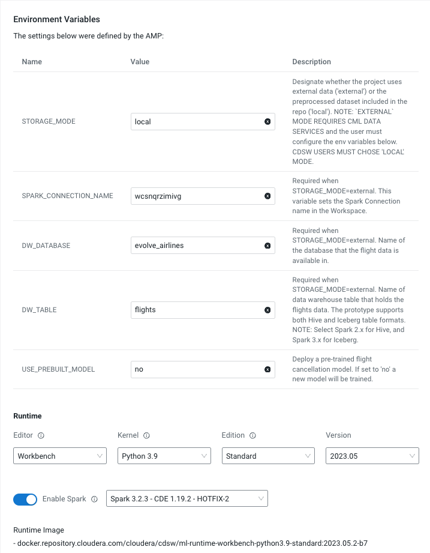

Cloudera Machine Learning will automatically execute the following 10 steps:

`Step 1:` Job to install dependencies

`Step 2:` Running the install dependencies job

`Step 3:` Job to process the raw data files

`Step 4:` Running job to process raw data files

`Step 5:` Job to train the model

`Step 6:` Run the model training job

`Step 7:` Create the flight delay prediction model API endpoint

`Step 8:` Build the model

`Step 9:` Deploy the model

`Step 10:` Start the Application

You can follow the executed step by clicking on the `View details` page to see the progress and what the prototype execution looks like in the background.

All the steps above should be successful before proceeding to the next steps. It takes roughly 8 minutes for the prototype to be deployed. You should see a `Completed all steps` message above the executed steps.

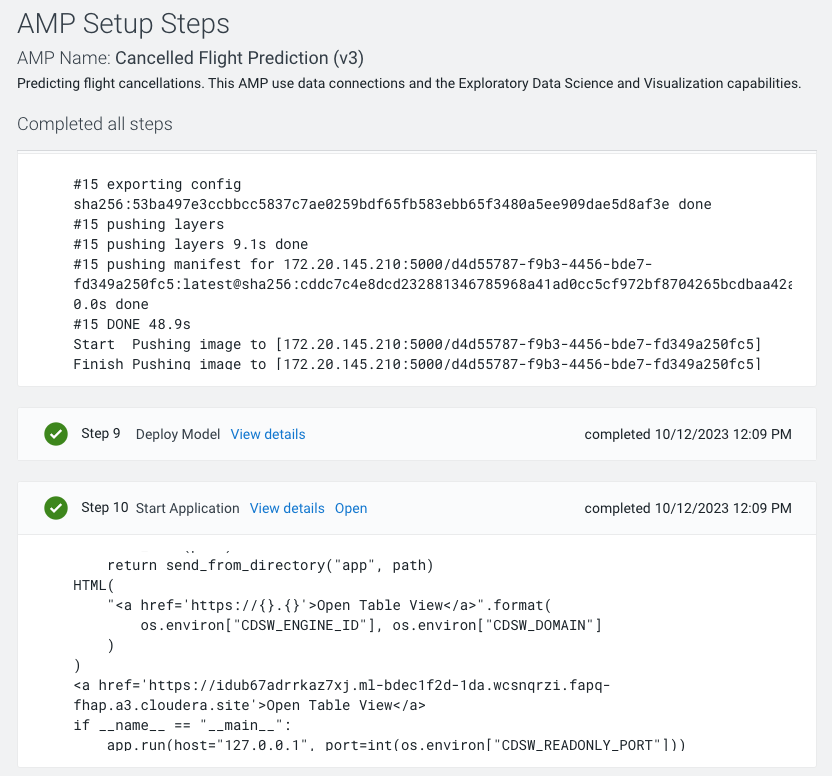

---

# Embedded Data Visualizations

## Lab 3: Create a Dataset

As part of deploying the AMP `Canceled Flight Prediction`, a Data Visualization application has been enabled.  We will dive into this Project in more detail during the [04_predict](04_predict.md#04_predict) phase.

In this lab, we will leverage the Data Visualization application to create a `Dataset` that contains a correlation across the various data we have ingested into our Data Lakehouse and prepare for creating visualizations.  

A `Dataset`, aka Data Model, is a logical representation of the data you want to use to build visuals. It is a logical pointer to a physical table or a defined structure in your data source. Datasets may represent the contents of a single data table or a data matrix from several tables that may be in different data stores on the same connection.

1. Once you finished setting up the `Canceled Flight Prediction` Machine Learning project as described in `Lab 2`.  You will be ready to start Data Visualization, click on the `Data` tab from the left nav.  Under 'Recent Connections' you should see a connection containing the name `dwarehouse`.

2. On the top, click `DATASETS`

    - In this lab, the Dataset we want to create will join the `flights` Iceberg table to the `airports` Iceberg table for the Origin Airport details and again for the Destination Airport details 

    

3. Now click `New Dataset`

    - `Dataset title` as `<prefix>-airlines-master`, replace &lt;prefix> with your prefix you used in 01_ingest phase

    - `Dataset Source` lets you choose between directly entering SQL or selecting tables from our Data Lakehouse.  Select `From Table`

    - In `Select Database` choose the `<prefix>_airlines` database you created in 01_ingest
    
    - In `Select Table` choose the `flights` Iceberg table

    - Click `CREATE` to create the Dataset (Data Model)

    --Need screenshot--

4. You will be taken back to the Datasets tab.  Under Title/Table, you will see the `<prefix>-airlines-master` Dataset we just created, click on it to open the Dataset.

5. On the left nav, click on `Data Model`.

    --Need screenshot--

6. To Join tables to the `flights` table, click on `EDIT DATA MODEL`

    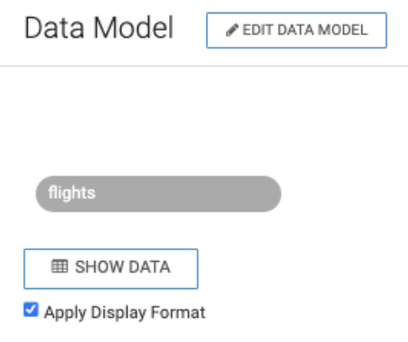

7. Click the `+` to the right of the flights table to join a table

    - In `Database Name` choose the `<prefix>_airlines` database you created in 01_ingest

    - In `Table Name` choose the `airlines` table

    - Click on `SELECT`

    --Need screenshot--

8. `Edit Join` popup

    - Under `<prefix>_airlines.flights` choose `uniquecarrier` from the drop-down

    - Under `<prefix>_airlines.airlines` choose `code` from the drop-down

    --Need screenshot--

9. Click the `+` to the right of the flights table to join a table

    - In `Database Name` choose the `<prefix>_airlines` database you created in 01_ingest

    - In `Table Name` choose the `airports` table

    - Click on `SELECT`

    --Need screenshot--

10. `Edit Join` popup

    - Under `<prefix>_airlines.flights` choose `origin` from the drop-down

    - Under `<prefix>_airlines.airports` choose `iata` from the drop-down

    --Need screenshot--

11. Click the `+` to the right of the flights table to join a table

    - In `Database Name` choose the `<prefix>_airlines` database you created in 01_ingest

    - In `Table Name` choose the `airports` table

    - Click on `SELECT`

    --Need screenshot--

12. `Edit Join` popup

    - Under `<prefix>_airlines.flights` choose `dest` from the drop-down

    - Under `<prefix>_airlines.airports` choose `iata` from the drop-down

    --Need screenshot--

13. To test if the Joins are working, click on `SHOW DATA`, you will see a table of data representing the `flights` table being joined to the `airports` table for the Origin and Destination airport details

    --Need screenshot--

14. Click `SAVE`

15. Click on `Fields` in the left nav

    --Need Screenshot--

16. Click on `EDIT FIELDS`

17. Click the `Mea` toggle button next to `month`

    - Cloudera Data Visualization (CDV) will try to classify the columns from each table into a Category (ie. Dimension or Measure)
    
    - This is important as CDV will use this information to assist in easing repetitive work and simplify building visuals

    - Dimensions - data that you will not usually aggregate and instead will 
    
    - Measures - would be fields that you would be aggregating (sum, count, average, etc.)

    --Need Screenshot--

18. -- Need content or remove --

19. Let's add a `flightdate` derived field

    - Sometimes the data in the base tables does not support needs. In this data, there is no timestamp representing the flight date. So, instead of adding these expressions for every visual created.

20. -- Need content or remove --

21. -- Need content or remove --

## Lab 4: Create a Dashboard

In this lab, we will create a sample dashboard to visualize the reports for a business user.

- Click on the `dataset` we created in Lab 2 and then click the `New Dashboard` icon.

    

We will now create 3 reports & charts in this dashboard, as follows

- Total arrival delays by Carrier
- Cities with the most number of delayed flights \(Top 10\)
- Correlate delays with origin & destination city pairs

### Total Arrival Delays by Carrier

1. Enter the tile for the dashboard as `Airlines dashboard`

2. Click `Visuals`, then `New Visual`

    

3. Click `Grouped Bars` as the chart type

4. From the `Dimensions` shelf, drag the `carrier` field into the `X Axis` field

5. From the `Measures` shelf, drag the `arrdelay` field into the `Y Axis` field

6. Enter the title for this chart as `Total arrival delays by Carrier`

    

### Cities with the Most Number of Delayed Flights \(Top 10\)

We will create a scatter chart to identify the cities that have the most number of delayed flights

1. Click `Visuals`, then `New Visual`

2. Click `Scatter` as the chart type

3. Enter the name of the chart as `Cities with the most number of delayed flights (Top 10)`

4. From the `Dimensions` shelf, drag the `destinationcity` field into the `X Axis` field

5. From the `Measures` shelf, drag the `Record Count` field into the `Y Axis` field & double click on the field you just brought in.

6. We now want only to show the top 10 records.

    a. Under `Field Properties` , go to `Order` and `Top K` field, then to Top K

    b. Enter `10` as the value and click `Refresh Visual`

    

### Correlate Delays with Origin and Destination City Pairs

For this use\-case, we will let Cloudera Data Visualization recommend a chart type for us.

1. Click `Visuals`, then `New Visual`
2. Now click on `Explore Visuals`

    

3. In the pop-up window, choose `origincity` and `destinationcity` on the `Dimensions` shelf. `Record Count` on the `Measures` shelf

4. The `Possible Visuals` pane will show you a list of recommended visuals.

5. You can explore the various charts and then choose `Correlation Heatmap`

6. Name your chart as `Correlate delays with origin & destination city pairs`

    

7. You can change the color of the correlation map by clicking on the `Explore Options` icon on top of the chart and then `Colors`, then choose a format you prefer

    

8. Click `Save` to save the dashboard.

As a next step, you can try creating a visual application based on the dashboard we just built and showcase what a business user dashboard could look like. The documentation is [here](https://docs.cloudera.com/data-visualization/7/howto-apps/topics/viz-create-app.html)

We are now ready to [Predict](04_predict.md#04_predict) the likelihood of a flight being canceled.