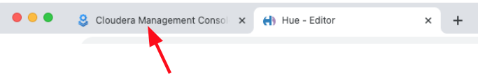
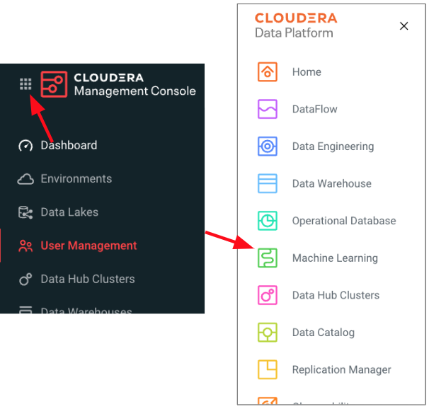

# 03_visualize

In this phase we will be working to create a Dashboard using the Data Lakehouse we created in the 01_ingest phase.

In this phase we will be deploying an end\-to\-end machine learning project that will also be used in the next phase [04_predict](04_predict.md).

## Pre-requisites

1. Please ensure that you have completed the [labs](01_ingest.md#01_ingest) to ingest data needed for Visualization.

2. Set your CDP Workload Password
   a. On your browser navigate back to the CDP Management Console



   b. Go back to CDP Home Page by clicking the bento menu icon in the top left corner of the Data Hub page


   b. In the bottom left corner find your user id and click on it, in the pop up click on `Profile`


   c. On the User Profile page, click on `Set Workload Password`


   d. Enter a strong password, confirm it and click on `Set Workload Password`


   e. You should see a message that the Workload password has been updated.


3. In Cloudera Machine Learning (CML) provide your CDP Workload Password

   a. Open Cloudera Machine Learning (CML)
      * Click the bento menu icon in the top left corner and select `Machine Learning`



   b. Note the **Environment Name**, under `Environment`, as it will be used as one of the inputs while we create our Machine Learning model.


   c. Click on the Workspace available in your Machine Learning page.  This is found under `Worksapce`

   d. Click on your user id in the top right corner, and click


   e. On the User Profile page, click on the `Environment Variables` tab


   f. Enter your Workload Password from **Step 2** in `WORKLOAD_PASSWORD` and click `Save`


# Cloudera Machine Learning (CML) Project

## Lab 1: Deploy Machine Leaning Applied Machine Learning Prototype (AMP)

1. Open Cloudera Machine Learning (CML)

   * If you just completed providing our Workload Password to CML, in the left nav click on Home.

   * If not, you can always go back to CDP Home Page by clicking the bento menu icon in the top left corner, click on Home, select the `Machine Learning` tile, and click on the Workspace available in your Machine Learning page (found under `Workspace`).  


2. Click AMPs in the left menu


3. Cloudera Machine Learning (CML) will show you a catalog of available Machine Learning Prototypes

4. Search for Canceled Flight Prediction prototype by entering `cancel` in the search box and click the prototype tile


5. Now click `Configure Project`


6. Wait for the Project to be created on the Project page \(takes a few seconds to load the code locally\)


We have now created a Cloudera Machine Learning (CML) Project that will be populated with all of the content making up the AMP we just deployed.  This includes: data, code, files, model definition, and an Flask application.

## Lab 2: Configure and Deploy Canceled Flight Prediction AMP

1. Open the created Cloudera Machine Learning (CML) Project you just created, named "Canceled Flight Prediction - &lt;user-id>" by clicking on the Project tile


2. CML will now give a series of Environment Variables for the user to fill in. Fill as below:
    * `STORAGE_MODE` as local
    * `SPARK_CONNECTION_NAME` with the Environment Name we collected above.
    * `DW_DATABASE` as `<prefix>_airlines` - where &lt;prefix> is the same &lt;prefix> you used in the 01_ingest phase
    * `DW_TABLE` as `flights`
    * `USE_PREBUILT_MODEL` as `no`
    * Enable the button next to `Enable Spark`

3. Leave the rest of the fields to be default.

4. Click `Launch Project`
   * Takes a few minutes to run the Jobs to build and deploy an end\-to\-end machine learning project)


Cloudera Machine Learning will automatically execute the following 10 steps:

`Step 1:` Job to install dependencies

`Step 2:` Running install dependencies job

`Step 3:` Job to process raw data files

`Step 4:` Running job to process raw data files

`Step 5:` Job to train model

`Step 6:` Run model training job

`Step 7:` Create the flight delay prediction model api endpoint

`Step 8:` Build model

`Step 9:` Deploy model

`Step 10:` Start Application

You can follow the step being executed by clicking on the `View details` page to see the progress and what the prototype execution looks like in the background.

All the steps above should be successful before proceeding to the next steps. It takes roughly 8 minutes for the prototype to be deployed.  You should see a `Completed all steps` message above the executed steps.


---

# Embedded Data Visualizations

## Lab 3: Create a dataset

In this lab, we will create a dataset that contains a correlation across the various datasets we have ingested and prepare for creating visualizations.

1. Once you finished setting up the `Canceled Flight Prediction` Machine Learning projectas described in `Lab 2`.  You will be ready to start Data Visualization, click on the `Data` tab from the left nav.  Under 'Recent Connections' you should see a connection containing the name `dwarehouse`.


2. Now click `New Dataset`

3. `Dataset title` as `<prefix>-airlines-master`, replace &lt;prefix> with your prefix you used in 01_ingest phase

--
--
-- the following will change from SQL to Tables & Joins --
4. `Data Source` as `From SQL`

5. Enter the below SQL query into the field:

```
select B.description as 'carrier', C.city as 'origincity', D.city 'destinationcity', A.*,
CAST(CONCAT(CAST(`year` AS STRING) , '-', CAST(`month` AS STRING), '-', CAST(`dayofmonth` AS STRING))
AS DATE FORMAT 'yyyy-mm-dd') as flightdate
from airlines.flights A
INNER JOIN airlines.airlines B ON A.uniquecarrier = B.code
INNER JOIN airlines.airports C ON A.origin = C.iata
INNER JOIN airlines.airports D ON A.dest = D.iata
```

7. Click `Create`

## Lab 4: Create a dashboard

In this lab, we will create a sample dashboard to visualize the reports for a business user.

1. Click on the `dataset` we created in Lab 2 and then click `New Dashboard` icon.


2. We will now create 3 reports & charts in this dashboard
    1. Total arrival delays by Carrier
    2. Cities with the most number of delayed flights \(Top 10\)
    3. Correlate delays with origin & destination city pairs

### Total arrival delays by Carrier

1. Enter a the tile for the dashboard as `Airlines dashboard`
2. Click `Visuals`, then `New Visual`


1. Click `Grouped Bars` as the chart type
2. From the `Dimensions` shelf, drag the `carrier` field into the `X Axis` field
3. From the `Measures` shelf, drag the `arrdelay` field into the `Y Axis` field
4. Enter the title for this chart as `Total arrival delays by Carrier`


### Cities with the most number of delayed flights \(Top 10\)

We will create a scatter chart to identify the cities that have the most number of delayed flights

1. Click `Visuals`, then `New Visual`
2. Click `Scatter` as the chart type
3. Enter the name of the chart as `Cities with the most number of delayed flights (Top 10)`
4. From the `Dimensions` shelf, drag the `destinationcity` field into the `X Axis` field
5. From the `Measures` shelf, drag the `Record Count` field into the `Y Axis` field & double click on the field you just brought in.
6. We now want to only show the top 10 records.
    1. Under `Field Properties` , go to `Order` and `Top K` field, then to Top K
    2. Enter `10` as the value and click `Refresh Visual`


### Correlate delays with origin & destination city pairs

For this use\-case, we will let Cloudera Data Visualization recommend a chart type for us.

1. Click `Visuals`, then `New Visual`
2. Now click on `Explore Visuals`


1. In the pop-up window, choose `origincity` and `destinationcity` on the `Dimensions` shelf. `Record Count` on the `Measures` shelf
2. The `Possible Visuals` pane will show you a list of recommended visuals.
3. You can explore the various charts and then choose `Correlation Heatmap`
4. Name your chart as `Correlate delays with origin & destination city pairs`


7. You can change the color of correlation map by clicking on the `Explore Options` icon on top of the chart and then `Colors`, then choose a format you prefer


Click `Save` to save the dashboard.

As a nextstep, you can try creating a visual application based on the dashboard we just built and showcase how a business user dashboard could look like. The documentation is [here](https://docs.cloudera.com/data-visualization/7/howto-apps/topics/viz-create-app.html)
