# 03_visualize

As part of the `Visualize` phase, we will be working to create a Dashboard using the Data Lakehouse we created in the [01_ingest](01_ingest.md) phase.

## Prerequisites

1. Please ensure that you have completed [00_prereqs](00_prereqs.md) to deploy the Applied Machine Learning Prototype (AMP) for `Canceled Flight Prediction`.
2. Please ensure that you have completed [01_ingest](01_ingest.md#01_ingest) to ingest the data needed for Visualizations.

# Cloudera Machine Learning (CML) Project

# Embedded Data Visualizations

## Lab 1: Create a Dataset

As part of deploying the AMP `Canceled Flight Prediction`, a Data Visualization application has been enabled.  We will dive into this Project in more detail during the [04_predict](04_predict.md#04_predict) phase.

In this lab, we will leverage the Data Visualization application to create a `Dataset` that contains a correlation across the various data we have ingested into our Data Lakehouse and prepare for creating visualizations.  

A `Dataset`, aka Data Model, is a logical representation of the data you want to use to build visuals. It is a logical pointer to a physical table or a defined structure in your data source. Datasets may represent the contents of a single data table or a data matrix from several tables that may be in different data stores on the same connection.

1. Once you finished setting up the `Canceled Flight Prediction` Machine Learning project as described in `Lab 2`.  You will be ready to start Data Visualization, click on the `Data` tab from the left nav.  Under 'Recent Connections' you should see a connection containing the name `dwarehouse`.

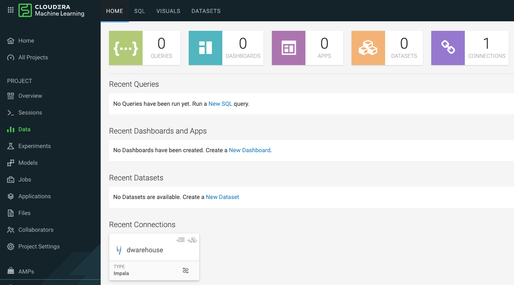

2. On the top, click `DATASETS`
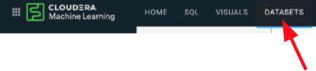

3. Now click `New Dataset`
    - In this lab, the Dataset we want to create will join the `flights` Iceberg table to the `airports` Iceberg table for the Origin Airport details and again for the Destination Airport details 
   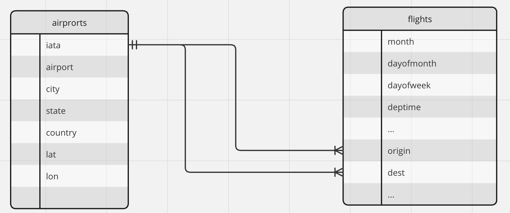

    - `Dataset title` as `<prefix>-airlines-master`, replace &lt;prefix> with your prefix you used in 01_ingest phase

    - `Dataset Source` lets you choose between directly entering SQL or selecting tables from our Data Lakehouse.  Select `From Table`

    - In `Select Database` choose the `<prefix>_airlines` database you created in 01_ingest
    
    - In `Select Table` choose the `flights` Iceberg table

    - Click `CREATE` to create the Dataset (Data Model)
    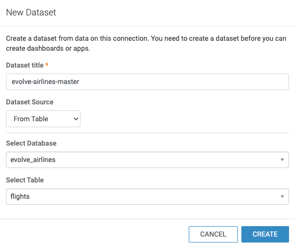

4. You will be taken back to the Datasets tab.  Under Title/Table, you will see the `<prefix>-airlines-master` Dataset we just created, click on it to open the Dataset.
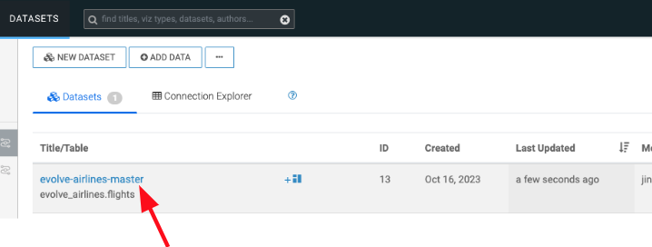

5. On the left nav, click on `Data Model`.
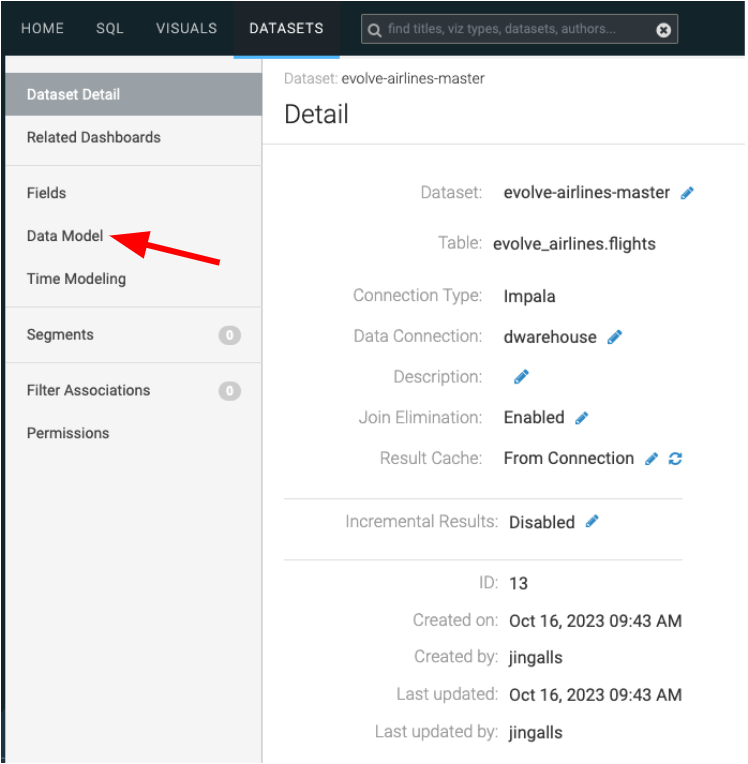

6. To Join tables to the `flights` table, click on `EDIT DATA MODEL`
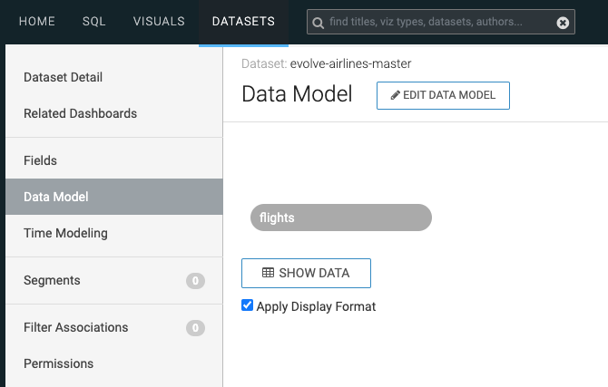

7. Click the `+` to the right of the flights table to join a table

    - In `Database Name` choose the `<prefix>_airlines` database you created in 01_ingest

    - In `Table Name` choose the `airlines` table

    - Click on `SELECT`
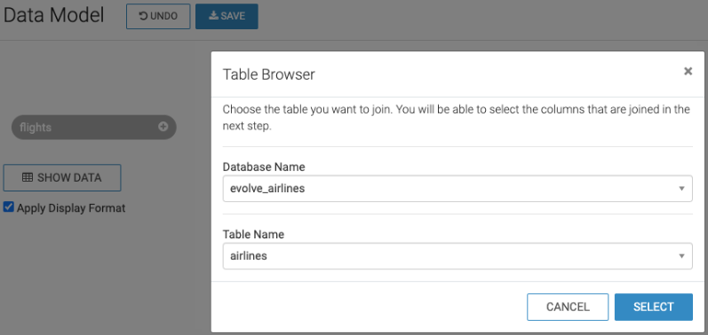

     - If an `Edit Join` pops up, click `APPLY`

8. Click the `+` to the right of the flights table to join a table

    - In `Database Name` choose the `<prefix>_airlines` database you created in 01_ingest

    - In `Table Name` choose the `airports` table

    - Click on `SELECT`
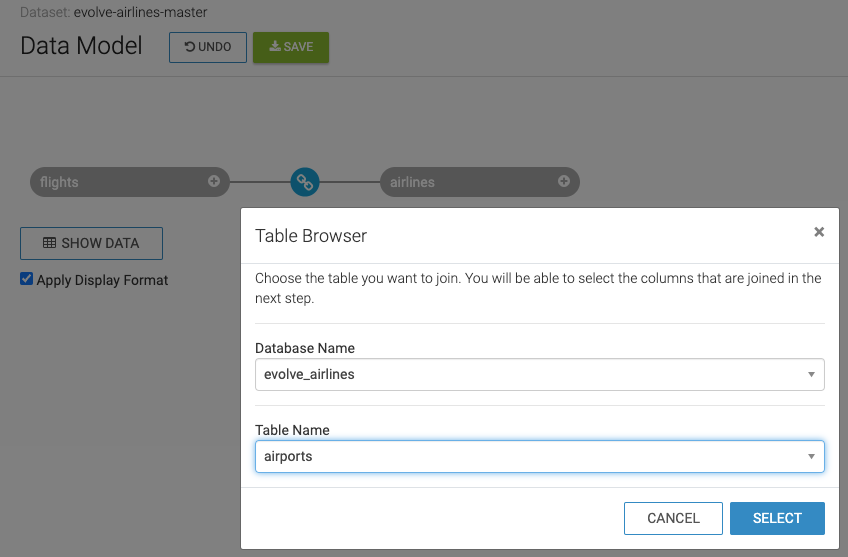

     - If an `Edit Join` pops up, click `APPLY`

9. Click the `+` to the right of the flights table to join a table

    - In `Database Name` choose the `<prefix>_airlines` database you created in 01_ingest

    - In `Table Name` choose the `airports` table

    - Click on `SELECT`
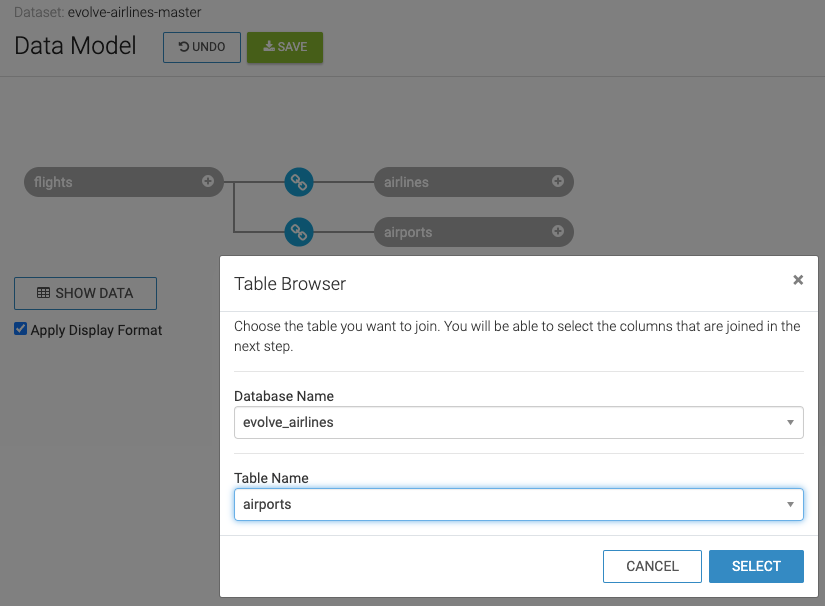

     - If an `Edit Join` pops up, click `APPLY`

10. Edit joins between flights and its dimension tables

* Select  (join) between the flights table and each dimension table (airlines, airports, airports_1)

* On `Join Details` select `Left` join for the type of join, and select `EDIT JOIN`
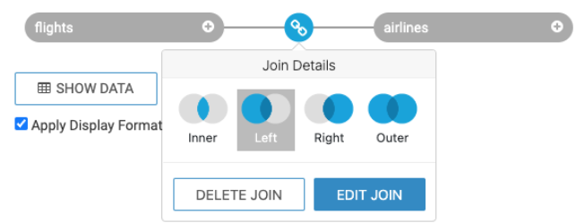

 * On `Edit Join` screen
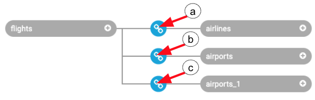

  a. Join between `flights` and `airlines`
   - Under `<prefix>_airlines.flights` choose `uniquecarrier` from the drop-down

   - Under `<prefix>_airlines.airlines` choose `code` from the drop-down
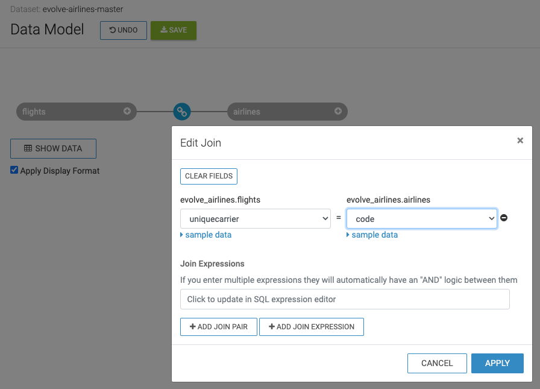

  b. Join between `flights` and `airlines` for the origin airport
   - Under `<prefix>_airlines.flights` choose `origin` from the drop-down

   - Under `<prefix>_airlines.airports` choose `iata` from the drop-down
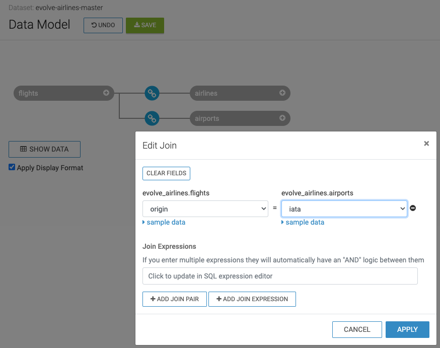

  c. Join between `flights` and `airlines` for the destination (dest) airport
   - Under `<prefix>_airlines.flights` choose `dest` from the drop-down

   - Under `<prefix>_airlines.airports` choose `iata` from the drop-down
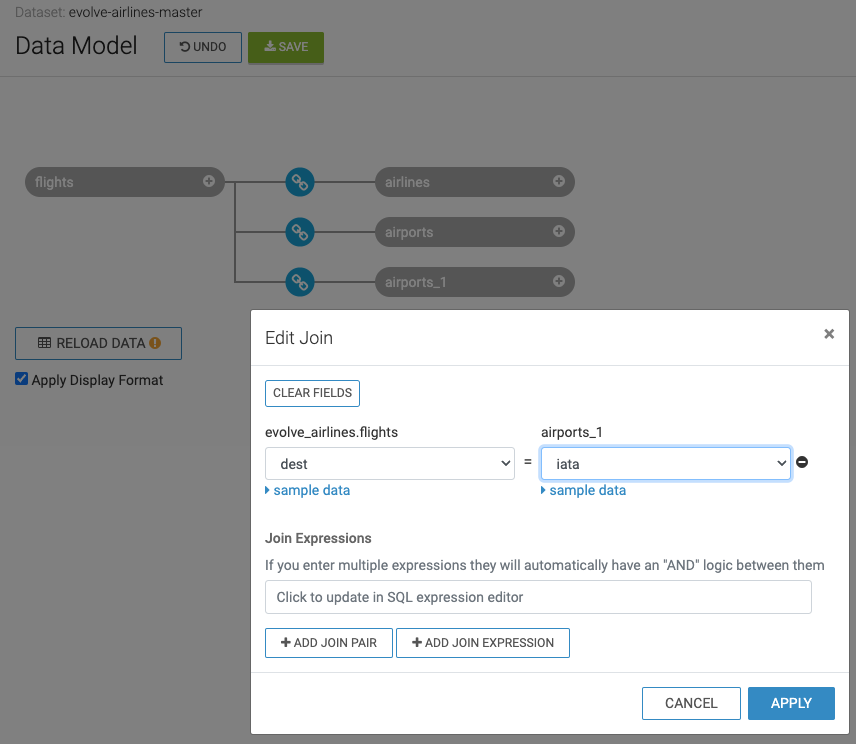

13. To test if the Joins are working, click on `SHOW DATA`, you will see a table of data representing the `flights` table being joined to the `airports` table for the Origin and Destination airport details
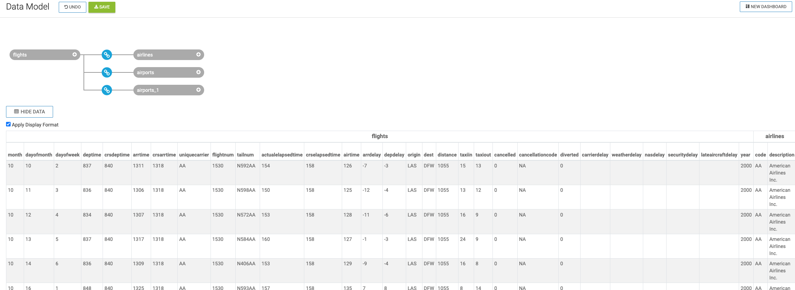

14. Click `SAVE`

15. Click on `Fields` in the left nav.  When building a Dataset it is common to:

   * Provide user-friendly names for columns
   * Create derived (calculate) attributes
   * Assign default behavior (Dimension or Measure) of a field
   * Change default aggregation of fields prevents common mistakes when building visuals

16. Click on `EDIT FIELDS`

17. Change default behavior of Fields
* Cloudera Data Visualization (CDV) will try to classify the columns from each table into a Category (ie. Dimension or Measure) to control default beahavior of the Field
  * Dimensions - data that you will not usually aggregate and instead will 
  * Measures - would be fields that you would be aggregating (sum, count, average, etc.)
* This is important as CDV will use this information to assist in easing repetitive work and simplify building visuals

* Under Measures - Click the `Mes` toggle button next to the following Fields, this will change the Field to a `Dim` 
  *  `month`
  * `dayofmonth`
  * `dayofweek`
  * `deptime`
  * `crsdeptime`
  * `arrtime`
  * `crsarrtime`
  * `flightnum`
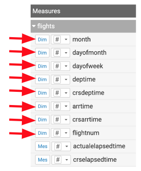

18. Under `Dimensions > airlines`, click the pencil next to `description`
   * Change `Display Name` to Carrier
   * Click `APPLY`
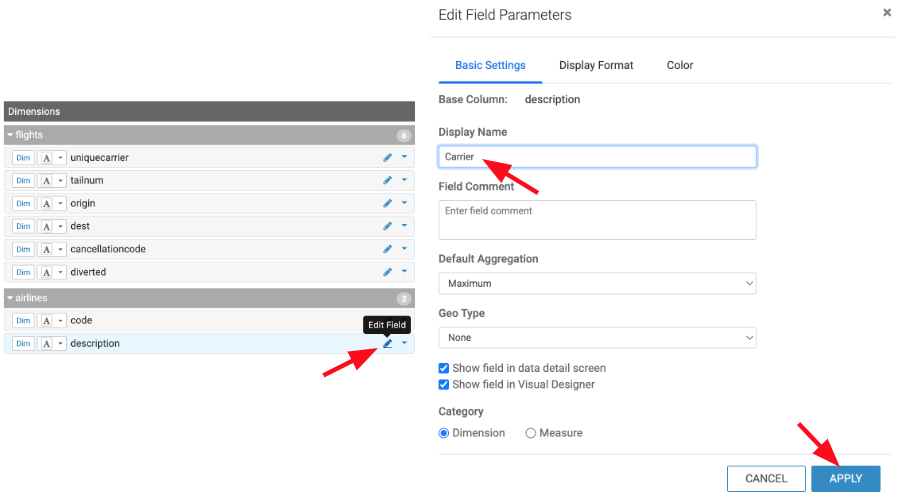

19. Under `Dimensions > airports`, click the pencil next to `city`
   * Change `Display Name` to Origin City
   * Click `APPLY`

20. Under `Dimensions > airports_1`, click the pencil next to `city`
   * Change `Display Name` to Destination City
   * Click `APPLY`

21. Add a derived field, `flightdate`
   * Sometimes the data in the base tables does not support needs. There is no timestamp representing the flight date. So, instead of adding these expressions for every visual created we can define it here.

a. Under Measures > flights, click the drop down arrow to the right of `month`, select `Clone`

b. Under Dimensions > airports, click the Pencil next to `Copy of month`
   * Change `Display Name` to Flight Date
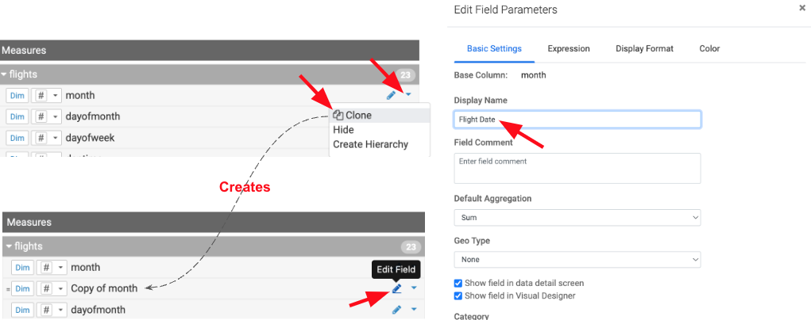

c. Click the `Expression` tab and paste the following
```
CAST(CONCAT(CAST(`year` AS STRING) , '-', CAST(`month` AS STRING), '-', CAST(`dayofmonth` AS STRING))
AS DATE FORMAT 'yyyy-mm-dd')
```

   * Click `VALIDATE EXPRESSION` to test the expression is valid

   * Click `APPLY`
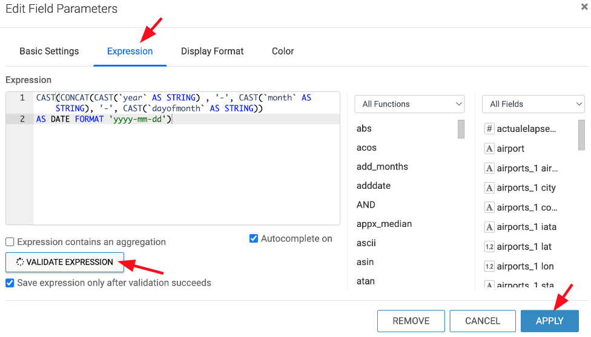

d. After the Field is saved you will see it has automatically set the data type to a Timestamp, to the left of `Flight Date` you will see a drop down and a calendar
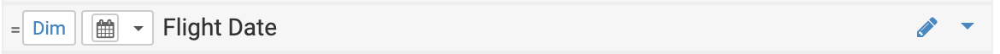

20. Click 'SAVE' to save the Dataset

--Need Screenshot--


* To compare what we just did to this Dataset, we can compare it to the following SQL

   `select B.description as carrier, C.city as origincity, D.city as destinationcity, A.*, CAST(CONCAT(CAST(year AS STRING) , '-', CAST(month AS STRING), '-', CAST(dayofmonth AS STRING)) AS DATE FORMAT 'yyyy-mm-dd') as flightdate from airlines.flights A INNER JOIN airlines.airlines B ON A.uniquecarrier = B.code INNER JOIN airlines.airports C ON A.origin = C.iata INNER JOIN airlines.airports D ON A.dest = D.iata`

   * In this SQL you can see the Joins between Flights and Airlines; Flights and Airports for origin airport; and Flights to Airports for destination airport

   * You can also see that `B.description as carrier`, `C.city as origincity`, and `D.city as destinationcity` all represent 

## Lab 2: Create a Dashboard

In this lab, we will create a sample dashboard to visualize the reports for a business user.

- Click on the `dataset` we created in Lab 2 and then click the `New Dashboard` icon.

    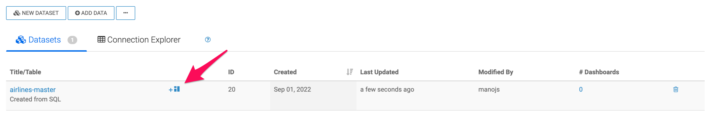

We will now create 3 reports & charts in this dashboard, as follows

- Total arrival delays by Carrier
- Cities with the most number of delayed flights \(Top 10\)
- Correlate delays with origin & destination city pairs

### Total Arrival Delays by Carrier

1. Enter the tile for the dashboard as `Airlines dashboard`

2. Click `Visuals`, then `New Visual`

    

3. Click `Grouped Bars` as the chart type

4. From the `Dimensions` shelf, drag the `carrier` field into the `X Axis` field

5. From the `Measures` shelf, drag the `arrdelay` field into the `Y Axis` field

6. Enter the title for this chart as `Total arrival delays by Carrier`

    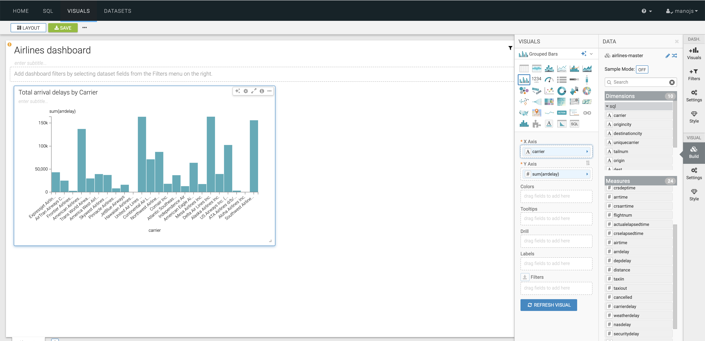

### Cities with the Most Number of Delayed Flights \(Top 10\)

We will create a scatter chart to identify the cities that have the most number of delayed flights

1. Click `Visuals`, then `New Visual`

2. Click `Scatter` as the chart type

3. Enter the name of the chart as `Cities with the most number of delayed flights (Top 10)`

4. From the `Dimensions` shelf, drag the `destinationcity` field into the `X Axis` field

5. From the `Measures` shelf, drag the `Record Count` field into the `Y Axis` field & double click on the field you just brought in.

6. We now want only to show the top 10 records.

    a. Under `Field Properties` , go to `Order` and `Top K` field, then to Top K

    b. Enter `10` as the value and click `Refresh Visual`

    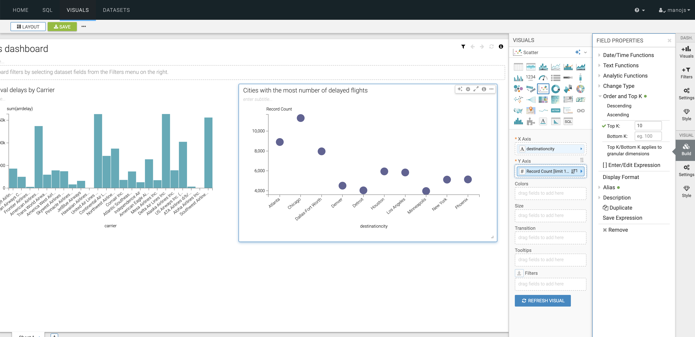

### Correlate Delays with Origin and Destination City Pairs

For this use\-case, we will let Cloudera Data Visualization recommend a chart type for us.

1. Click `Visuals`, then `New Visual`
2. Now click on `Explore Visuals`

    

3. In the pop-up window, choose `origincity` and `destinationcity` on the `Dimensions` shelf. `Record Count` on the `Measures` shelf

4. The `Possible Visuals` pane will show you a list of recommended visuals.

5. You can explore the various charts and then choose `Correlation Heatmap`

6. Name your chart as `Correlate delays with origin & destination city pairs`

    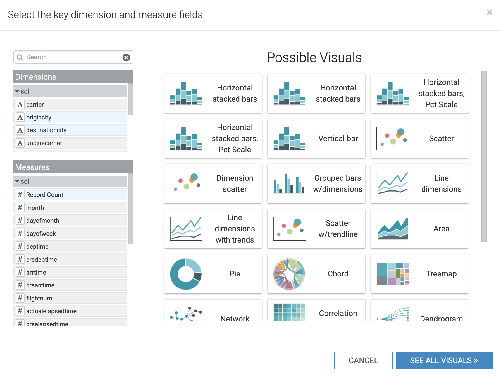

7. You can change the color of the correlation map by clicking on the `Explore Options` icon on top of the chart and then `Colors`, then choose a format you prefer

    

8. Click `Save` to save the dashboard.

As a next step, you can try creating a visual application based on the dashboard we just built and showcase what a business user dashboard could look like. The documentation is [here](https://docs.cloudera.com/data-visualization/7/howto-apps/topics/viz-create-app.html)

We are now ready to [Predict](04_predict.md#04_predict) the likelihood of a flight being canceled.