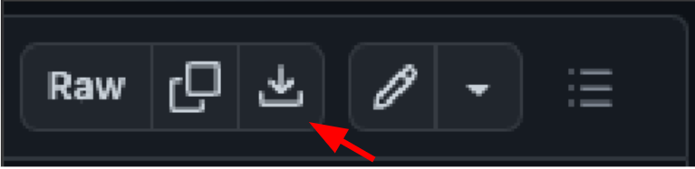
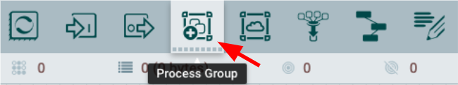
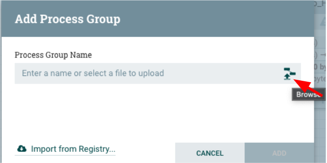
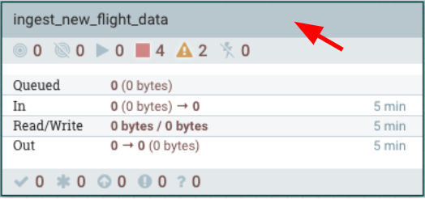

# Ingesting New Flight Data

In this `Ingesting New Flight Data` module, you will supplement the data ingested from AWS S3 in the [01_ingest](01_ingest.md) phase by ingesting more recent airline data. To do this, you will:

- Import an existing data flow
- Get an overview of Cloudera Flow Management (CFM) and the imported data flow
- Configure and run the imported data flow 

CFM is a no-code data ingestion and management solution powered by Apache NiFi. With NiFi’s intuitive graphical interface and processors, CFM delivers highly scalable data movement, transformation, and management capabilities to the enterprise.

# Import Flow Definition

To import a data flow into CFM, the first thing we need to do is import a flow definition file.

1. Open a web browser and go to https://github.com/cdp-trial-patterns/opendatalakehouse

2. Click on the file called `ingest_new_flight_data.json` and click the download icon to download the flow definition file to your local machine. 

    

3. Click and drag the Process Group and drag it onto the canvas

    

4. After dragging the Process Group icon onto the canvas, click the Browse icon to upload the flow definition file downloaded in the previous step.

    

5. Double-click the `ingest_new_flight_data` Process Group in the canvas

    

# Flow Management Data Flow Overview

Now that we have imported a flow definition file into CFM, let's rewind to understand how we got here. This is a previously created, fully functional data flow, similar to a [ReadyFlow](https://docs.cloudera.com/dataflow/cloud/howto-using-readyflows.html) template available in [DataFlow for the Public Cloud](https://www.cloudera.com/products/dataflow.html).

- Show the toolbox first
    - Talk about how it got built -- this is a drag-and-drop of processors that you see on the screen

- Show the yellow box
- Show that it's low-code / no-code
    - What do we mean by this?

- At some point, we want to walk through dragging a process onto the canvas, but not actually complete it

    - Drag onto canvas
        - Show and highlight a few processors to showcase sources and destinations, based on processors that are already on the canvas
            - Show ListS3
            - Show PutIceberg
            - Show ConvertRecord
                - Generally explain many different types of transformations that can be done
                - NiFi is commonly used as a raw data movement and transformation tool
                - Explain how we can transform between data types (CSV, Avro, etc.) 
        - Many sources, such as S3, relational databases
        - Many destinations like S3, etc

Walk through each processor in order.

    - Generally talk about the relationships between the processors. 

ListS3 Processor

    - One of the many sources we can connect to and pull data from

RouteOnAttribute

    - Routing is important in order to do special or prescriptive processing

FetchS3Object

    - The fetch will retrieve the zipped raw airline data from the S3 bucket

 UnpackContent

    - Since the files are zipped, we need to uncompress them.
    - 3 configurable properties
    - Mention that we can compress, uncompress and handle file manipulations, as needed

ConvertRecord

    - Introduce the concept of Controller Services
    - RecordReader -- explain what this is/does
    - RecordWriter -- explain
    - Schemaless vs Schema -- NiFi can work in a schema-less way, but when we need to write to a table in a database, we need to ensure we have the right layout with the correct fields, so we need to define a schema to support this.

PutIceberg

    - We are going to insert data into our existing Iceberg table
        - We are using the Iceberg table we created in the `01_ingest` module
    - Show the concept of Parameters, where the database and table names are parametertized
        - Allows us to dynamically define values that can be reused throughout our processors
    - Show the relationships tab and talk about failures
        - In this case, we're routing failures to a failure queue
        - Since this is a trial, we don't have this connected to an email alert, but in a Production 
        - setting, we could easily route failures to an email alert processor
            - For example, use the PutEmail processor to send an email to the data administrator
            - to alert when a failure occurs

Tie off on the flow. When we deploy our flow to Production:

    - Talk about the success and failure queues
    - Send an email alert when a failure occurs, so that we don't have to actively monitor 

# Flow Definition Configuration

Parameters

- Access Key ID and Secret Key - We may not need this, but depends on how the public S3 bucket gets implemented

- Bucket -- The name won't need to be changed by the trial user, but this name will be where new data will be written to (each month, a new file will be placed in this bucket)

- Show database parameter

    - They will have to change the database name to `prefix_airlines`

- Show table name parameter

- Hive Metastore -- we may need to change this

- Workload User - This will need to be changed before we export the final flow definition

Controller Services

- We will need to start most of them, show how this is done

